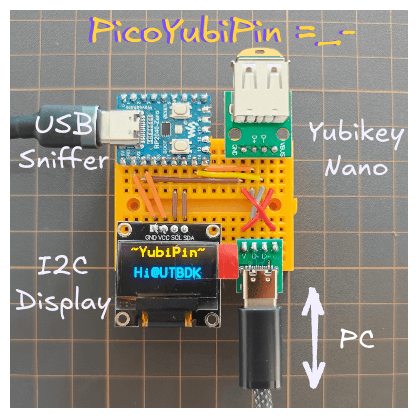
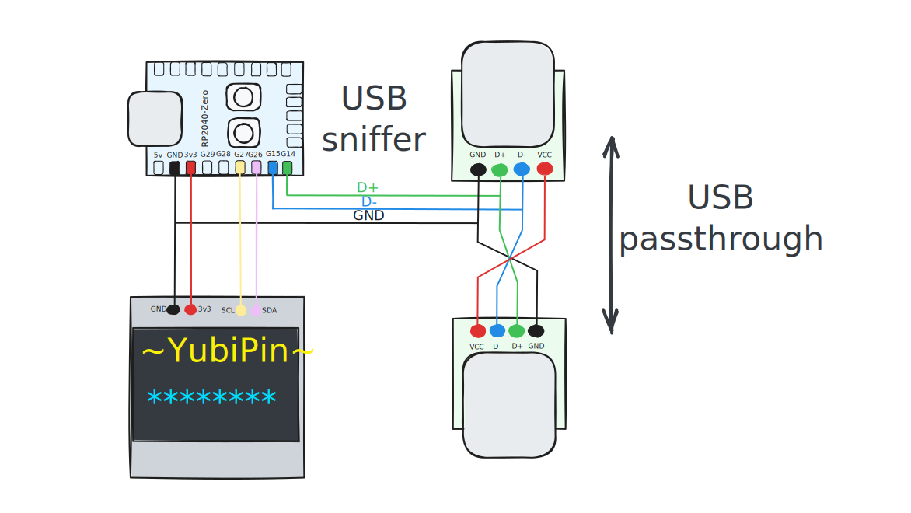

# PicoYubiPin
A simple Yubikey PIV PIN stealer based on RP2040 USB Sniffer.

# How it works?
[Проект выходного дня: PicoYubiPin](https://ut.buglloc.com/iot/esphome/pico-yubipin/)

# Components
  - [RP2040-Zero](https://www.waveshare.com/wiki/RP2040-Zero)
  - [I2C 0.96" OLED](https://github.com/WeActStudio/WeActStudio.OLEDModule)
  - USB connectors
  - Wires

# Wiring diagram

# See also
  - [Super simple USB sniffer using Raspberry Pi Pico](https://github.com/tana/pico_usb_sniffer). It inspired me to make YubiPin.
  - [Usb Sniffer Lite for RP2040](https://github.com/ataradov/usb-sniffer-lite). Another RP2040-based USB sniffer.
